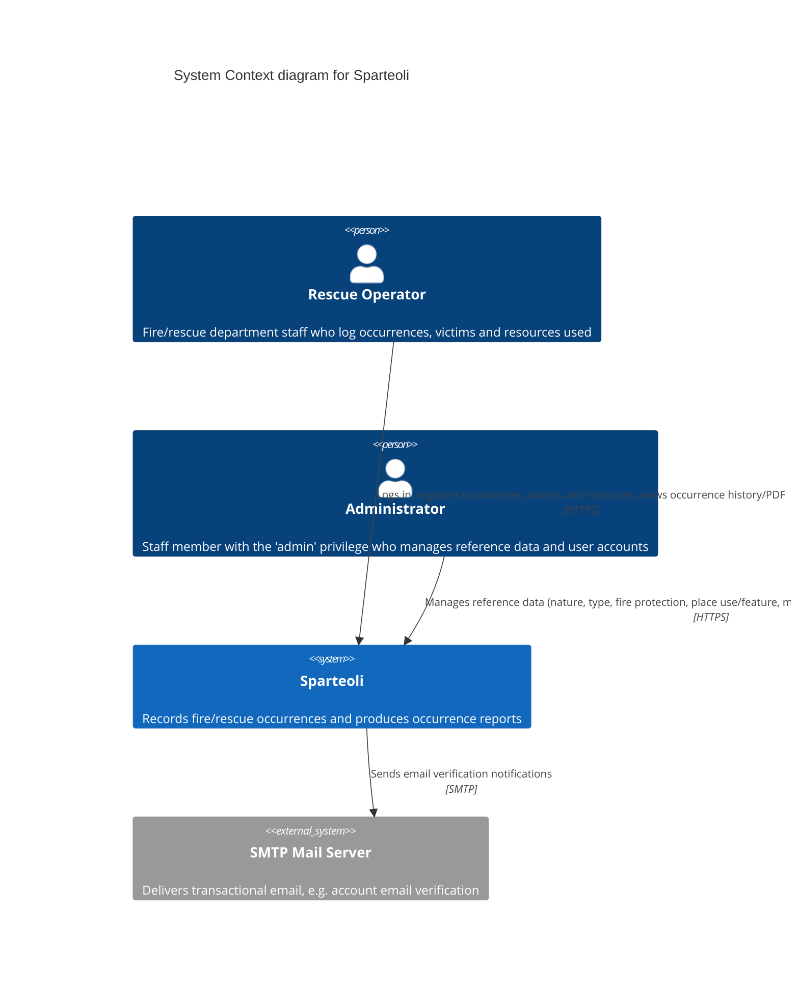

# Level 1 — System Context

Who uses Sparteoli, and what does it talk to outside its own boundary.

## Notes

- There is a single first-party user population — internal department staff — split
  into two authorization tiers by the `admin` boolean flag on `users` (see
  `App\Providers\AppServiceProvider`'s `Gate::define('admin', ...)`), not two separate
  systems. Both are modeled as `Person` actors here because they interact with the
  system directly through a browser.
- There is no public/anonymous-facing part of the system; every route except `/login`
  sits behind the `auth` middleware.
- The only outbound integration is transactional email (Laravel's built-in email
  verification listener). In local development this is caught by Mailpit; in
  production it goes through a real SMTP relay (`MAIL_MAILER=smtp`).
- The application does not call out to any third-party APIs (payment, SMS, maps, etc.).
