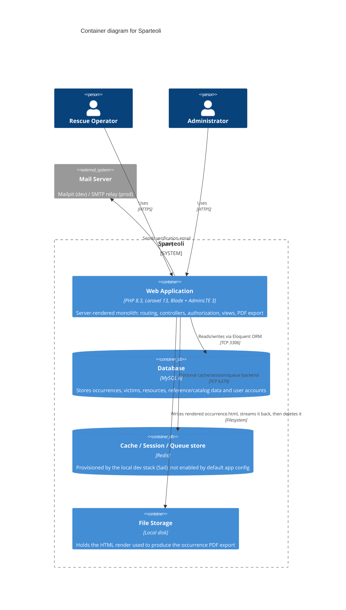

# Level 2 — Container

The deployable/runtime pieces that make up Sparteoli, and how they talk to each other.

## Notes

- **Single application container.** There is no separate API/backend split — the same
  Laravel app serves HTML pages, handles form submissions, and enforces authorization.
  `routes/api.php` exists (Sanctum is installed) but is unused by the product today.
- **MySQL is the only container the app actually depends on for correctness.** It holds
  every domain table: `occurrences`, `victims`, `resources`, `rescuers`, `users`, and
  the reference/catalog tables (`natures`, `types`, `fireprotections`, `placeuses`,
  `place_features`, `means_used`, `problems`) plus the `occurrence-fireprotection` and
  `victims-problems` pivot tables.
- **Redis is provisioned but not wired in by default.** `docker-compose.yml` (Laravel
  Sail) starts a Redis container, but `.env.example` ships with
  `SESSION_DRIVER=file`, `CACHE_DRIVER=file`, and `QUEUE_CONNECTION=sync`. Treat Redis
  as available infrastructure, not a load-bearing dependency, unless those env vars are
  changed.
- **File storage is transient, not a data store.** `OccurrenceController::toPdf()`
  renders the `occurrence.pdf` Blade view to `storage/app/occurrence.html`, streams it
  back as the response, then deletes it (`deleteFileAfterSend()`). Nothing durable lives
  on disk between requests.
- **Local dev vs. production topology differs.** Locally the stack runs via Laravel
  Sail (`docker-compose.yml`: `laravel.test`, `mysql`, `redis`, `mailpit`). The
  `Procfile` (`web: vendor/bin/heroku-php-apache2 public/`) indicates production target
  is Heroku, where MySQL/Redis/mail would be managed add-ons rather than the containers
  shown above.
