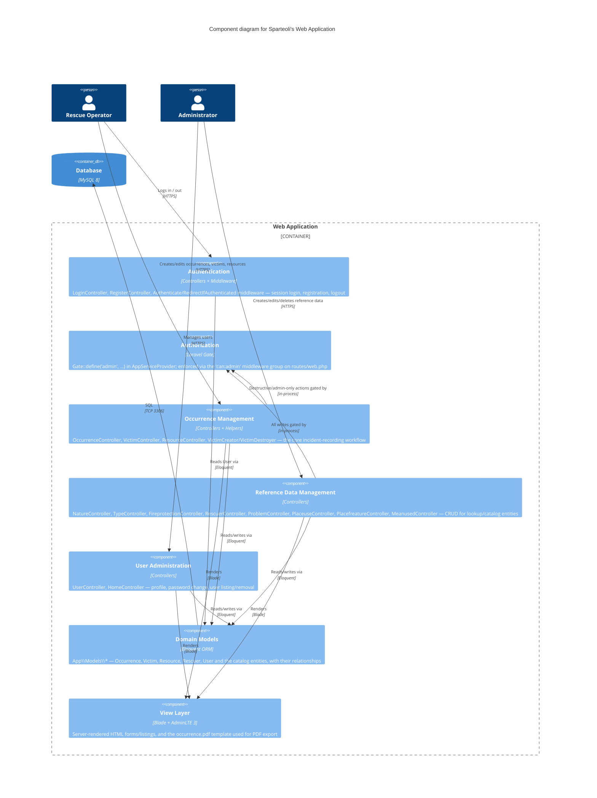

# Level 3 — Component (Web Application container)

The internal building blocks inside the "Web Application" container from the
[Container diagram](02-container.md).

## Component responsibilities

- **Authentication** — `App\Http\Controllers\Auth\LoginController` /
  `RegisterController`, using the stock Laravel `AuthenticatesUsers` /
  `RegistersUsers`-style concerns. Notably, login is by `register` (badge/registration
  number), not email — `LoginController::username()` returns `'register'`.
- **Authorization** — a single Gate, `admin`, checked with the `can:admin` middleware
  around an entire route group in `routes/web.php`. There is no per-resource policy
  class; authorization is coarse-grained (you're either an admin who can create/edit/
  delete everything, or an operator who can only read catalog data and create
  occurrences/victims/resources).
- **Occurrence Management** — the reason the system exists. `OccurrenceController`
  handles the occurrence lifecycle (including `toPdf()` for report export);
  `VictimController` and `ResourceController` manage the children of an occurrence
  (routes are nested under `/occurrence/{occurrence_id}/...`); `VictimCreator` and
  `VictimDestroyer` in `App\Helpers` encapsulate the extra step of attaching/detaching
  the victim's `problems` (a many-to-many) around the create/delete.
- **Reference Data Management** — eight near-identical CRUD controllers for the
  lookup tables operators pick from when filling an occurrence (nature, type, fire
  protection, place use, place feature, means used, problem, rescuer). These are
  admin-only to write, but readable by any authenticated user (index/show routes sit
  outside the `can:admin` group).
- **User Administration** — profile viewing/editing, password changes, and (admin-only)
  user listing/removal. `HomeController` just renders the post-login landing page.
- **Domain Models** — plain Eloquent models under `App\Models`; business rules are
  limited to attribute mutators (e.g. name/address normalization via
  `set*Attribute()`) — there is no separate service/repository layer.
- **View Layer** — Blade templates styled with the `jeroennoten/laravel-adminlte`
  package; one `occurrence.pdf` view doubles as the HTML source rendered to disk and
  streamed back for the "download PDF" feature (see
  [Container notes](02-container.md) on why that's not a real PDF renderer, just an
  HTML file served with a `.html` extension).
