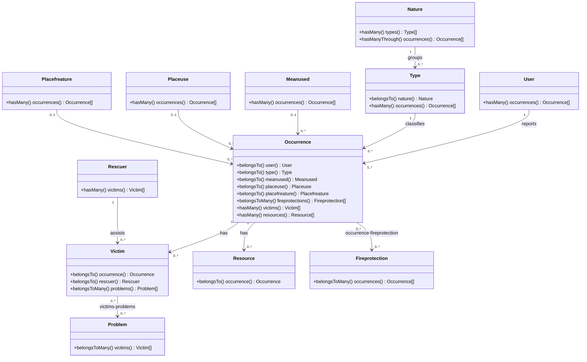

# Level 4 — Code (Occurrence domain model)

The C4 model's code level is a regular UML diagram of the classes inside a single
component. `Occurrence` is the aggregate root the rest of the domain hangs off, so this
is the domain model behind the **Occurrence Management** and **Reference Data
Management** components from the [Component diagram](03-component-web-application.md).

## Notes

- Every model uses `protected $guarded = []` (mass-assignment fully open) rather than an
  explicit `$fillable` list — the exception is `User`, which does define `$fillable`
  (`name`, `register`, `password`, `admin`) since it extends `Authenticatable`.
- `Nature -> Type -> Occurrence` is a classification hierarchy: an operator picks a
  `Type` when creating an occurrence, and a `Type` belongs to a `Nature`. `Nature`
  exposes `occurrences()` as a convenience `hasManyThrough(Occurrence::class,
  Type::class)` — there is no direct `nature_id` on `occurrences`.
- `Victim <-> Problem` and `Occurrence <-> Fireprotection` are the two many-to-many
  relationships in the schema, backed by the `victims-problems` and
  `occurrence-fireprotection` pivot tables respectively (non-standard, hyphenated
  table names — worth knowing before writing raw queries against them).
- Attribute mutators (`set*Attribute()`) normalize casing on the way in (e.g. names
  are title-cased, `who` on `Resource` is upper-cased) — this is the only business
  logic living on the models themselves; everything else is orchestration in
  controllers/helpers.
- `VictimCreator`/`VictimDestroyer` (`App\Helpers`) sit just outside this diagram: they
  wrap `Victim::create()` / `Victim::delete()` together with the `problems()`
  attach/detach step, so a victim is never left with dangling pivot rows.
